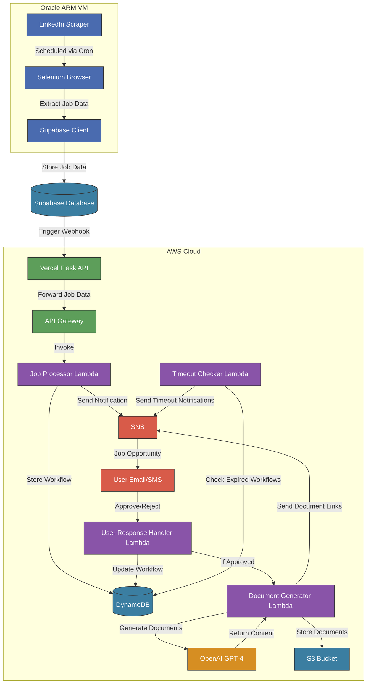

# Job Application Assistant

An automated system that scrapes job listings, analyzes them with AI, and generates tailored application documents.

## Project Overview

This project streamlines the job application process by:

1. Scraping job listings from LinkedIn
2. Storing job data in a Supabase database
3. Using AI to identify promising job opportunities
4. Generating tailored resumes and cover letters for selected jobs

## System Architecture


### Components

#### 1. Job Scraper (`/scraper`)

- Selenium-based web scraper for LinkedIn job listings
- Runs on an Oracle ARM VM with cron scheduling
- Stores job data in Supabase database

#### 2. Webhook API (`/api`)

- Flask server deployed on Vercel
- Listens for Supabase database webhooks
- Parses job data and forwards to AWS Lambda for processing
- Initiates the AI workflow

#### 3. AWS Lambda Functions (`/aws`)

- **Job Processor**: Evaluates jobs using AI to determine quality matches
- **User Response Handler**: Processes approval/rejection decisions
- **Document Generator**: Creates tailored resumes and cover letters
- **Timeout Checker**: Manages workflow timeouts

#### 4. Notification System

- Uses AWS SNS for notifications
- Sends job opportunities for review
- Delivers links to generated documents

## Workflow

1. The scraper collects job listings from LinkedIn on a scheduled basis
2. New job data triggers a webhook in Supabase
3. The webhook API forwards job data to AWS Lambda
4. The job processor evaluates the job with AI and creates a workflow
5. A notification is sent for review (approve/reject)
6. Upon approval, the document generator creates tailored application materials
7. A notification with document links is sent

## Technologies Used

- **Frontend**: HTML/CSS for response pages
- **Backend**: Python, Flask
- **Database**: Supabase (PostgreSQL)
- **Cloud**: AWS Lambda, S3, DynamoDB, SNS
- **AI**: OpenAI GPT-4
- **Deployment**: Vercel, AWS SAM
- **Automation**: Selenium, Cron

## Setup and Deployment

See the README files in each component directory for specific setup instructions:

- [Scraper Setup](/scraper/README.md)
- [API Setup](/api/README.md)
- [AWS Lambda Setup](/aws/README.md)

## Development Setup

This project uses a shared models package across multiple applications. Follow these steps to set up your development environment:

### 1. Clone the Repository

```bash
git clone https://github.com/yourusername/job-application-assistant.git
cd job-application-assistant
```

### 2. Set Up the Shared Models

Run the setup script to install the shared models package and create necessary symlinks:

```bash
chmod +x setup_dev.sh
./setup_dev.sh
```

This script:
- Installs the models package in development mode
- Creates symlinks to make the models accessible to all applications
- Sets up your environment for local development

### 3. Running Individual Applications

#### API (Flask)
```bash
cd api
pip install -r requirements.txt
flask run
```

#### Scraper
```bash
cd scraper
pip install -r requirements.txt
python main.py
```

#### AWS Lambda Functions (Local Testing)
```bash
cd aws
sam local invoke JobProcessorFunction -e events/job_event.json
```

## Deployment

The project uses GitHub Actions for automated deployment to different environments:

### API Deployment (Vercel)

The API is automatically deployed to Vercel when changes are pushed to the `main` branch affecting the `api/` or `models/` directories. The workflow:
- Packages the shared models with the API
- Deploys to Vercel using your configured project settings

### AWS Lambda Deployment

AWS Lambda functions are deployed using AWS SAM when changes are pushed to the `main` branch affecting the `aws/` or `models/` directories. The workflow:
- Creates a Lambda Layer containing the shared models
- Builds and deploys all Lambda functions with the shared layer
- Sets environment variables based on GitHub secrets

### Scraper Deployment (Oracle VM)

The scraper is deployed to an Oracle VM when changes are pushed to the `main` branch affecting the `scraper/` or `models/` directories. The workflow:
- Packages the scraper with the shared models
- Transfers the package to the VM via SSH
- Installs dependencies and restarts the service

## Project Structure

```
job-application-assistant/
├── api/                  # Flask API for webhooks
├── aws/                  # AWS Lambda functions
│   ├── job_processor/    # Evaluates jobs with AI
│   ├── document_generator/ # Creates tailored documents
│   ├── user_response/    # Handles user approvals/rejections
│   └── timeout_checker/  # Manages workflow timeouts
├── models/               # Shared data models
│   └── job_models.py     # Core data structures
├── scraper/              # LinkedIn job scraper
└── .github/workflows/    # CI/CD pipelines
```

## Working with Shared Models

When making changes to the data models:

1. Update the models in the `models/` directory
2. Run `./setup_dev.sh` to update symlinks
3. Test changes across all applications
4. Commit and push changes - GitHub Actions will handle deployment

The shared models ensure consistency across all components of the system.

## License

[MIT License](LICENSE)